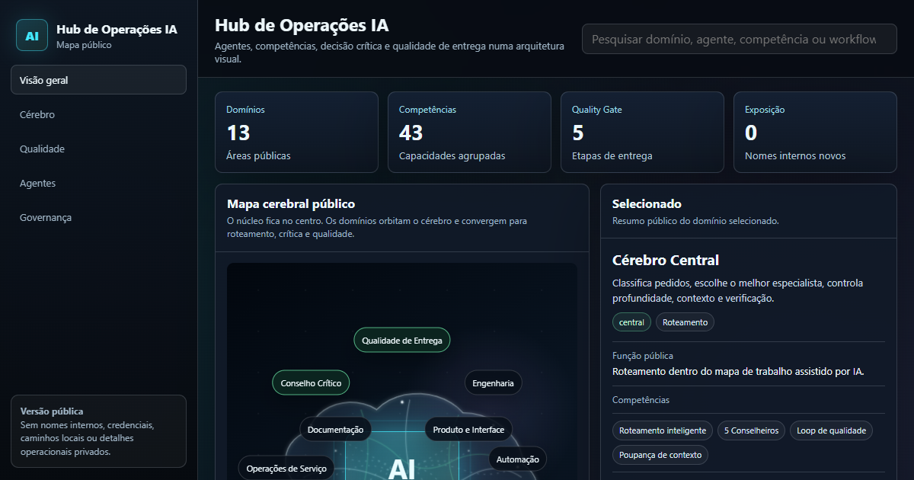

# Hub de Operações IA

Mapa interativo público de uma arquitetura de trabalho assistido por IA. O projeto mostra como um cérebro central pode coordenar agentes, competências, decisão crítica, qualidade de entrega e poupança de contexto sem expor detalhes operacionais internos.

## Demonstração

- Repositório: <https://github.com/garcialabss/my-ai-operations-hub>
- Site: <https://garcialabss.github.io/my-ai-operations-hub/>

O GitHub Pages está configurado a partir da branch `gh-pages`.

## Objetivo

Tornar uma arquitetura de trabalho com IA fácil de entender visualmente:

- cérebro central no meio da tomada de decisão;
- agentes organizados por domínio público;
- filtro crítico dos 5 Conselheiros para evitar validação automática;
- loop Spec -> Build -> Review -> Fix -> Deliver para reduzir retrabalho;
- níveis de risco e verificação proporcionais ao impacto;
- versão pública sanitizada, sem nomes internos, caminhos locais ou credenciais.

## Indicado Para

- demonstração em portfólio ou CV;
- destaque no LinkedIn;
- explicação de orquestração de agentes e competências;
- apresentação de como IA pode apoiar operações, engenharia, automação, segurança, documentação e governança.

## Ficheiros

- `index.html` - site estático completo.
- `social-preview.png` - imagem de preview para LinkedIn e redes sociais.
- `.nojekyll` - evita processamento Jekyll no GitHub Pages.

## Publicação

Este repositório publica o site estático a partir da branch `gh-pages` e da pasta raiz.

Fluxo recomendado:

1. Manter os ficheiros fonte na branch `main`.
2. Publicar os ficheiros estáticos na branch `gh-pages`.
3. Ativar GitHub Pages em `gh-pages` e `/`.

## Nota de Segurança

Esta é a versão pública e sanitizada. O workspace original, scripts reais, nomes internos de sistemas, caminhos locais e detalhes operacionais privados não devem ser publicados.

## O Que Demonstra

- Arquitetura de workflows com IA.
- Organização pública de agentes e competências.
- Qualidade de entrega com especificação, execução controlada e revisão.
- Filtro crítico antes de recomendações importantes.
- Frontend estático com animação leve e sem dependência de backend.
- Publicação de portfólio com atenção à segurança.
